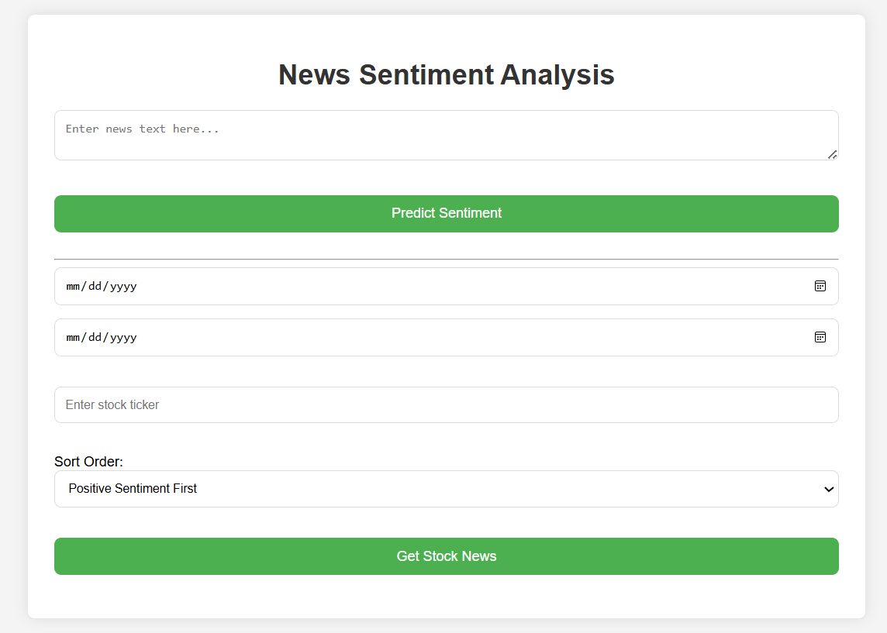

```markdown
# Stock Market Sentiment Analysis
This project is designed to predict stock market movements based on the sentiment of news articles related to specific stocks. It leverages machine learning models to analyze historical stock data, extract sentiment from news articles, and predict whether a stock will go up or down based on that sentiment.

## Features

- **Sentiment Analysis**: Uses machine learning models to classify the sentiment of stock-related news articles as "positive" or "negative."
- **Stock Movement Prediction**: Predicts stock price movements based on news sentiment.
- **Data Collection**: Automatically fetches historical stock data and news articles.
- **Machine Learning Models**: Trains and evaluates multiple machine learning models to select the best model for stock prediction.
- **Flask Web API**: A simple web interface where users can input stock news articles or specify a date range to fetch news and predict stock movements.
- **Background Scheduler**: Automates the pipeline to run at a scheduled time (e.g., daily), ensuring models are updated with fresh data.

## Requirements

Before running the project, make sure you have the following Python packages installed:

- Flask
- APScheduler
- yfinance
- scikit-learn
- joblib
- pandas
- numpy
- matplotlib
- requests
- nltk

You can install them using pip:

```bash
pip install -r requirements.txt
```

You will also need to have Python 3.6 or higher installed.

## Project Structure

The project is organized as follows:

```
.
├── README.md              # Project overview and documentation
├── src/
│   ├── api/               # Flask web API code
│   │   └── app.py         # Flask app that handles user requests
│   ├── pipeline/          # Main pipeline for sentiment analysis and stock prediction
│   │   └── main_pipeline.py # Core machine learning pipeline
│   ├── scheduler/         # Background scheduler for automating tasks
│   │   └── scheduler.py    # Manages scheduling of periodic tasks
│   └── static/            # Static files for frontend (e.g., CSS, images)
│   └── templates/         # HTML templates for frontend
│   │   └── index.html     # The main web page
└── requirements.txt       # List of dependencies
```

## How It Works

1. **Sentiment Analysis**:
   - News articles are processed and classified into "positive" or "negative" sentiment using a pre-trained machine learning model (such as Logistic Regression, Random Forest, or SVC).
   - The sentiment analysis helps predict how a stock will perform based on the news article.

2. **Stock Movement Prediction**:
   - The model predicts whether a stock will go up or down based on the sentiment of the news articles.
   - Historical stock data is fetched using `yfinance` and paired with the sentiment scores to train and evaluate the models.

3. **Scheduler**:
   - The `APScheduler` is used to schedule the machine learning pipeline, ensuring that it runs at regular intervals (e.g., every day at 2 AM).
   - The scheduler fetches the latest stock data and news articles, retrains the model, and saves the updated model for future use.

4. **Flask Web API**:
   - The Flask application provides an interface for users to input a news article or specify a date range and stock ticker for analysis.
   - The backend processes the input, performs sentiment analysis, and predicts stock movements.

## How to Use

### 1. Install Dependencies

First, clone the repository and install the required dependencies.

```bash
git clone https://github.com/yourusername/stock-sentiment-analysis.git
cd stock-sentiment-analysis
pip install -r requirements.txt
```

### 2. Running the Flask Web API

To run the Flask app, use the following command:

```bash
python src/api/app.py
```

The app will be hosted locally at `http://127.0.0.1:5000/`. You can open this URL in your web browser to interact with the app.

### 3. Scheduling the Pipeline Task

The machine learning pipeline is scheduled to run periodically. To start the scheduler, run:

```bash
python src/scheduler/scheduler.py
```

This will start a background job that ensures the pipeline runs at the scheduled time (e.g., every day at 2 AM).

### 4. Making Predictions

#### Predict Sentiment and Stock Movement from a News Article:

You can use the `/predict` route to input a news article and predict its sentiment and stock movement. Here's how you can do that:

- Open the application in a browser.
- Go to the `Predict` page.
- Input a stock-related news article and submit the form.

The system will:
- Perform sentiment analysis on the article.
- Predict the stock movement based on the sentiment.
- Show the predicted result.

#### Predict Stock Movement from Date Range:

You can also input a date range and a stock ticker to get news articles from that period, perform sentiment analysis on them, and predict the stock movement.

- Open the application in a browser.
- Go to the `Predict by Date Range` page.
- Enter a date range and a stock ticker (e.g., `AAPL`).
- Submit the form to get predictions.

### 5. Training the Model

The model is trained automatically as part of the pipeline, but you can also retrain it manually by running:

```bash
python src/pipeline/main_pipeline.py
```

This script will train the machine learning models and save the best model, vectorizer, and scaler for future use.

### 6. Stopping the Flask App

To stop the Flask app, simply press `Ctrl+C` in your terminal.

### 7. Stopping the Scheduler

To stop the scheduler, press `Ctrl+C` in the terminal where the scheduler is running.

## Example of Running the Pipeline

```bash
# To manually run the pipeline
python src/pipeline/main_pipeline.py
```

This will load historical stock data, train the models, and save the best-performing model.

## Models Used

The following machine learning models are trained and evaluated in the pipeline:

- **Logistic Regression**
- **Support Vector Classifier (SVC)**
- **Random Forest Regressor**

The model with the best performance (based on R² score and MSE) is selected for making predictions.


## Acknowledgements

- [yfinance](https://github.com/ranaroussi/yfinance): A Python library to download Yahoo Finance data.
- [Flask](https://flask.palletsprojects.com/): A web framework for building the API.
- [APScheduler](https://apscheduler.readthedocs.io/): A Python library to schedule background jobs.


### Instructions for usage in the `README.md` file:

1. **Installation**: This section explains how to install dependencies, set up the environment, and run the application.
2. **Running the Application**: Describes how to run both the Flask web API and the background scheduler.
3. **Making Predictions**: Details how users can make predictions based on news articles or date ranges.
4. **Retraining the Model**: Provides instructions on how to manually train the machine learning models.
5. **Licenses and Contributions**: Includes sections on licensing and how to contribute to the project.

